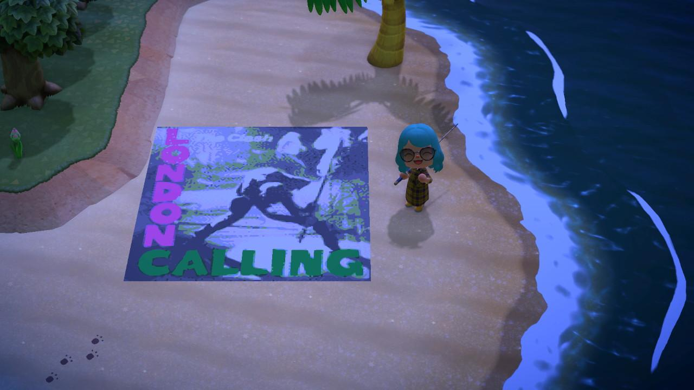

# Animal Crossing Pattern Maker

## About

Takes an image, formats it into 128x128 and 15-color before splitting it into 16 tiles and 
generating a QR code so that it can be scanned into Animal Crossing titles.



## How To Run

Download the .exe from the [Releases](https://github.com/sambeckingham/ACPatternMaker/releases) page
and then either:

#### Drag and Drop

Drag and drop your image file on top of the executable file

#### Command line

In your command line, run it with your image file as the first parameter, e.g. for Windows:

```sh
.\ACPatternMaker.exe C:\path\to\awesome\pic.jpg
```

Hopefully I'll have a web for this soon :)

## Todo

- [ ] Convert main logic into class library
- [ ] Build CI/CD chain
- [ ] Test macOS/Linux builds
- [ ] Build server that can accept images and return QR codes
- [ ] Webapp so users can upload images in browser and get QR codes

## Useful Links
- https://acpatterns.com/editor
- https://hex-works.com/